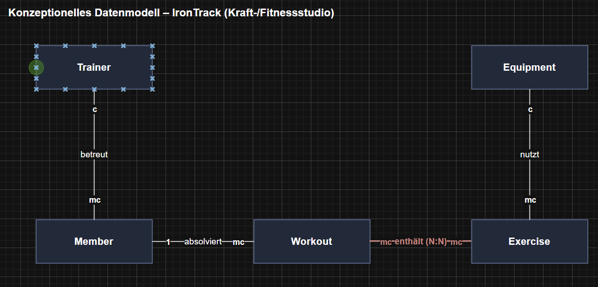
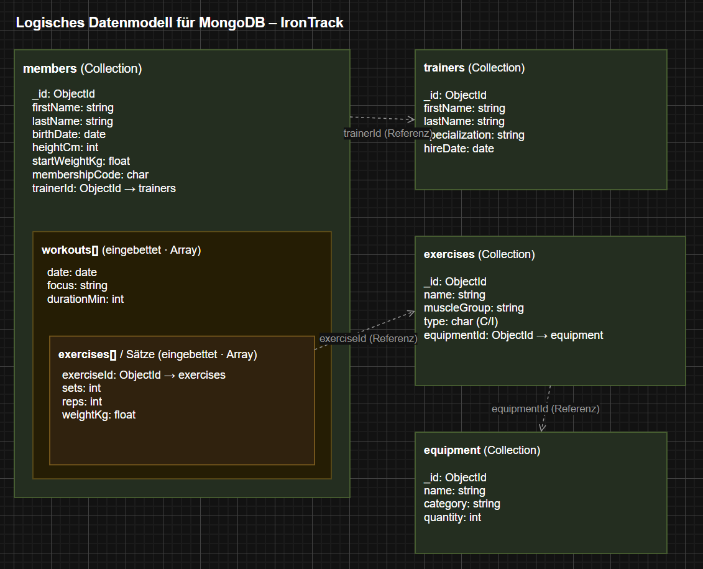
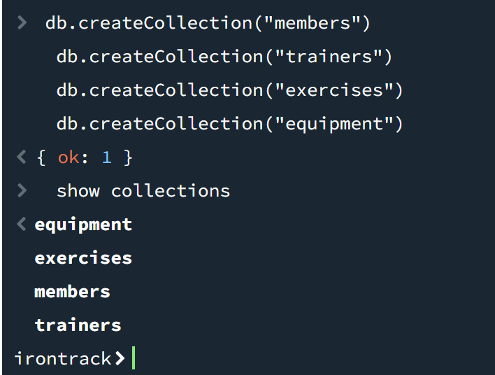

# KN-M-02: Datenmodellierung für MongoDB

**Modul m165 · Denis Suciu** — Lösung zur [Aufgabenstellung.md](./Aufgabenstellung.md).
**Thema (ganzes Modul): „IronTrack" — ein Kraft-/Fitnessstudio** (Mitglieder, Trainer, Workouts mit Übungen/Sätzen, Übungskatalog, Geräte). *Noch kein JSON-Schema (folgt später).*

| Datei | Inhalt |
|-------|--------|
| [`konzeptionell.drawio`](./konzeptionell.drawio) / `pictures/konzeptionell.png` | Konzeptionelles Modell (A) |
| [`logisch.drawio`](./logisch.drawio) / `pictures/logisch.png` | Logisches MongoDB-Modell (B) |
| [`create-collections.mongodb.js`](./create-collections.mongodb.js) / `pictures/c-collections.png` | Collections-Skript + Nachweis (C) |

---

## A) Konzeptionelles Datenmodell (30 %)



| Entität | Beschreibung |
|---------|--------------|
| **Member** | Mitglied, das trainiert. |
| **Trainer** | Coach, der Mitglieder betreut. |
| **Workout** | Eine Trainingseinheit eines Mitglieds. |
| **Exercise** | Eine Übung aus dem Katalog (z. B. Kniebeuge). |
| **Equipment** | Ein Gerät/Trainingsmittel (z. B. Langhantel). |

| Beziehung | Kardinalität | Bedeutung |
|-----------|--------------|-----------|
| Trainer **betreut** Member | c : mc | Mitglied hat 0–1 Trainer; Trainer betreut 0–n Mitglieder. |
| Member **absolviert** Workout | 1 : mc | Workout gehört 1 Mitglied; Mitglied hat 0–n Workouts. |
| Workout **enthält** Exercise | mc : mc | **N:N** – Workout hat viele Übungen, Übung in vielen Workouts. |
| Exercise **nutzt** Equipment | mc : c | Übung nutzt 0–1 Gerät; Gerät dient 0–n Übungen. |

**Kardinalitäten:** `1` = genau eins · `c` = 0/1 · `m` = ≥1 · `mc` = 0..n. Sind beide Enden „viele" (`mc:mc`), ist es eine **netzwerkförmige N:N**-Beziehung, die aufgelöst werden muss.

**Bedingungen:** 5 Entitäten (≥ 4) ✓ · eine N:N-Beziehung (Workout ↔ Exercise, rot) ✓.

---

## B) Logisches Modell für MongoDB (60 %)



**4 Collections:** `members` (bettet `workouts[]` ein, das wiederum `exercises[]`/Sätze einbettet), `trainers`, `exercises`, `equipment`.

**Datentypen:** string (Namen, `focus`, …) · int (`heightCm`, `sets`, `reps`, `quantity`, `durationMin`) · float (`startWeightKg`, `weightKg`) · char (`membershipCode`, `type` = C/I) · **date** (`birthDate`, `hireDate`, `workouts.date`).

**Bedingungen:** ø ≥ 3 Attribute/Entität ✓ · int/float/string/char ✓ · ≥ 1 date ✓ · Verschachtelung über 2 Ebenen (`members ⊃ workouts[] ⊃ exercises[]`) ✓.

### Begründung der Verschachtelung (Embedding vs. Referenz)

- **Member → Workout (1:mc): eingebettet.** Workouts werden fast immer *mit* dem Mitglied gelesen („Trainingsverlauf") → eine Abfrage, gute Lokalität. *Nachteil:* das Array wächst unbegrenzt (16-MB-Limit). Für reine studioweite Auswertungen wäre eine eigene `workouts`-Collection mit `memberId` besser.
- **Workout ↔ Exercise (N:N): eingebettetes Array von Referenzen.** Jeder Eintrag hat `exerciseId` + die assoziativen Werte `sets`/`reps`/`weightKg` (gehören zur *Paarung*). Übungs-Stammdaten werden **referenziert**, nicht eingebettet → keine Redundanz/Update-Anomalie.
- **Trainer ↔ Member & Exercise ↔ Equipment: Referenz.** Geteilte, eigenständige Entitäten → `trainerId` bzw. `equipmentId` statt vielfacher Kopien.

**Fazit:** eingebettet wird, was zusammen gelesen wird und „zu eins gehört"; referenziert wird, was geteilt und unabhängig gepflegt wird.

---

## C) Anwendung in MongoDB (10 %)

DB **`irontrack`**, Skript [`create-collections.mongodb.js`](./create-collections.mongodb.js) (kein JSON-Schema):

```js
use irontrack            // separat ausführen
db.createCollection("members")
db.createCollection("trainers")
db.createCollection("exercises")
db.createCollection("equipment")
show collections
```



---

## Abgaben-Übersicht

| Teil | Abgabe | Ort |
|------|--------|-----|
| A | Draw.io-Datei + Bild + Erklärung Entitäten/Beziehungen | `konzeptionell.drawio` · `pictures/konzeptionell.png` · Abschnitt A |
| B | Draw.io-Datei + Bild + Erklärung Verschachtelung | `logisch.drawio` · `pictures/logisch.png` · Abschnitt B |
| C | Skript + Screenshot der Collections | `create-collections.mongodb.js` · `pictures/c-collections.png` |
