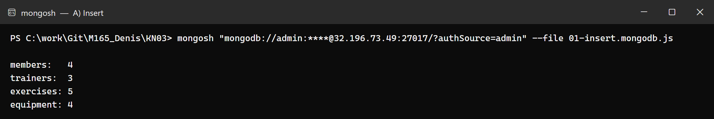
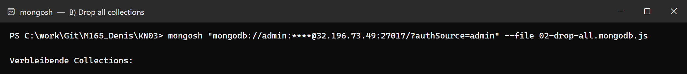
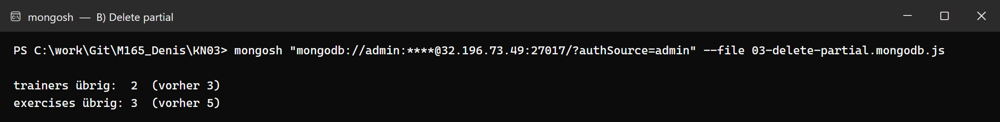
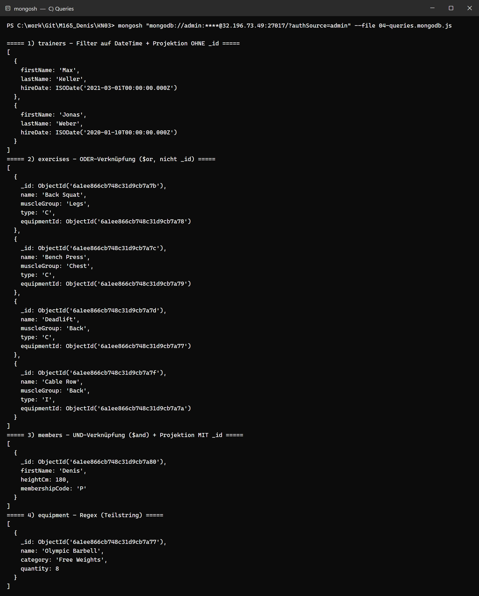
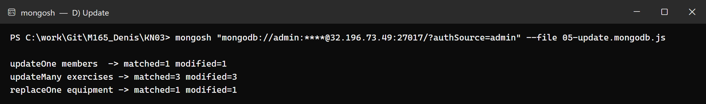

# KN-M-03: Datenmanipulation und Abfragen I

**Modul m165 · Denis Suciu** — Lösung zur [Aufgabenstellung.md](./Aufgabenstellung.md).
CRUD-Operationen auf der Datenbank **`irontrack`** (Thema Kraft-/Fitnessstudio aus KN02), einfache Abfragen ohne Verknüpfung zwischen Collections.

### Skripte & Ausführung

| Datei | Teil |
|-------|------|
| [`01-insert.mongodb.js`](./01-insert.mongodb.js) | A) Daten hinzufügen |
| [`02-drop-all.mongodb.js`](./02-drop-all.mongodb.js) | B) alle Collections löschen |
| [`03-delete-partial.mongodb.js`](./03-delete-partial.mongodb.js) | B) einzelne Datensätze löschen |
| [`04-queries.mongodb.js`](./04-queries.mongodb.js) | C) Daten abfragen |
| [`05-update.mongodb.js`](./05-update.mongodb.js) | D) Daten verändern |

Jedes Skript wählt die DB selbst (`db = db.getSiblingDB("irontrack")`) und ist eigenständig ausführbar — entweder als Datei (`mongosh "<connection-string>" --file <datei>`) oder durch Einfügen in die MONGOSH-Shell von Compass. Die Skripte C, D und das Teil-Löschskript räumen zuerst auf und legen die Daten neu an.

---

## A) Daten hinzufügen (25 %)

Skript [`01-insert.mongodb.js`](./01-insert.mongodb.js) füllt alle vier Collections (trainers 3, equipment 4, exercises 5, members 4).

- Alle `_id` werden über `new ObjectId()` in **Variablen** gesetzt (keine hartcodierten Werte) und für Referenzen (`trainerId`, `equipmentId`, `exerciseId`) wiederverwendet.
- **`insertMany()`** für `trainers`, `equipment`, `exercises`.
- **`insertOne()`** (erstes Mitglied) **und `insertMany()`** (übrige Mitglieder) für `members`.

---

## B) Daten löschen (25 %)

**Skript 1 – alle Collections löschen** ([`02-drop-all.mongodb.js`](./02-drop-all.mongodb.js)): `db.<collection>.drop()` für alle vier Collections — dient als Aufräum-Skript.

**Skript 2 – einzelne Datensätze löschen** ([`03-delete-partial.mongodb.js`](./03-delete-partial.mongodb.js)):
- `deleteOne({ _id: t3 })` — löscht genau einen Trainer über die `_id`.
- `deleteMany({ $or: [ { _id: ex4 }, { _id: ex5 } ] })` — löscht 2 von 5 Übungen über eine **ODER-Verknüpfung** der `_id` (nicht alle).

---

## C) Daten abfragen (25 %)

Skript [`04-queries.mongodb.js`](./04-queries.mongodb.js) — alle Bedingungen erfüllt, **nie** nach `_id` gefiltert:

| # | Collection | Technik |
|---|-----------|---------|
| 1 | `trainers` | Filter auf **DateTime** (`hireDate < 2022-01-01`) + Projektion **ohne** `_id` |
| 2 | `exercises` | **ODER** (`$or`: muscleGroup `Back` oder type `C`) |
| 3 | `members` | **UND** (`$and`: membershipCode `P` und heightCm ≥ 175) + Projektion **mit** `_id` |
| 4 | `equipment` | **Regex** (`/Ba/i` als Teilstring im Namen) |

→ mind. eine Abfrage pro Collection, DateTime-Filter, ODER, UND (andere Collection als ODER), Regex, Projektion mit und ohne `_id`.

---

## D) Daten verändern (25 %)

Skript [`05-update.mongodb.js`](./05-update.mongodb.js) — drei Befehle auf drei **unterschiedlichen** Collections:

- **`updateOne`** auf `members` mit `_id` als Filter (Tim → Premium-Abo).
- **`updateMany`** auf `exercises` **ohne** `_id`, mit `$or` (Legs **oder** Back) — verändert 3 Dokumente.
- **`replaceOne`** auf `equipment` — ersetzt das „Cable Machine"-Dokument komplett.

---

## Abgaben-Übersicht

| Teil | Abgabe | Ort |
|------|--------|-----|
| A | Insert-Skript + Screenshot | `01-insert.mongodb.js` · `pictures/a-insert.png` |
| B | Drop-all-Skript + Teil-Lösch-Skript + Screenshots | `02-drop-all.mongodb.js` · `03-delete-partial.mongodb.js` · `pictures/b1-drop-all.png` · `pictures/b2-delete-partial.png` |
| C | Abfrage-Skript + Screenshot | `04-queries.mongodb.js` · `pictures/c-queries.png` |
| D | Update-Skript + Screenshot | `05-update.mongodb.js` · `pictures/d-update.png` |
